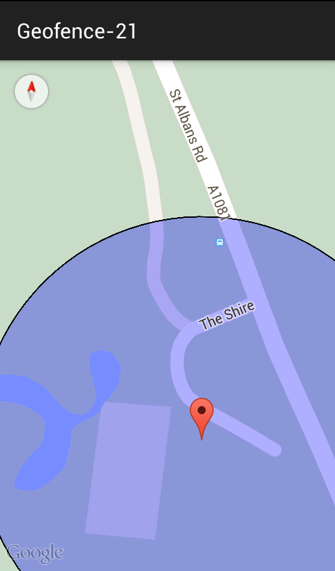
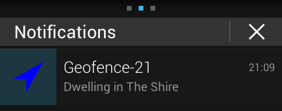
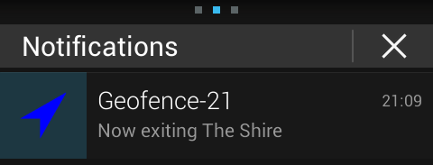

# Geofencing step by step

I spent a lot of time [making geofencing work]("https://github.com/vhoen/AndroidGeofencing") with Android API level 19. Unfortunately, Google has deprecated LocationClient, replaced it by [LocationRequest]("https://developer.android.com/reference/com/google/android/gms/location/LocationRequest.html"). In the process the Geofencing documentation disappeared. With a bit of digging, I found a StackOverflow post with a working example.

Here is a working example on how to use the Geofencing API : 


## [Creating a SimpleGeofence type](./src/me/hoen/geofence_21/SimpleGeofence.java)
```java
public class SimpleGeofence {
    private final String id;
    private final double latitude;
    private final double longitude;
    private final float radius;
    private long expirationDuration;
    private int transitionType;
    private int loiteringDelay = 60000;

    public SimpleGeofence(String geofenceId, double latitude, double longitude,
            float radius, long expiration, int transition) {
        this.id = geofenceId;
        this.latitude = latitude;
        this.longitude = longitude;
        this.radius = radius;
        this.expirationDuration = expiration;
        this.transitionType = transition;
    }

    public Geofence toGeofence() {
        Geofence g = new Geofence.Builder().setRequestId(getId())
                .setTransitionTypes(transitionType)
                .setCircularRegion(getLatitude(), getLongitude(), getRadius())
                .setExpirationDuration(expirationDuration)
                .setLoiteringDelay(loiteringDelay).build();
        return g;
    }
}
```

## [Creating a few SimpleGeofences](./src/me/hoen/geofence_21/SimpleGeofenceStore.java)
```java
public class SimpleGeofenceStore {
    private static final long GEOFENCE_EXPIRATION_IN_HOURS = 12;
    public static final long GEOFENCE_EXPIRATION_IN_MILLISECONDS = GEOFENCE_EXPIRATION_IN_HOURS
            * DateUtils.HOUR_IN_MILLIS;
    protected HashMap<String, SimpleGeofence> geofences = new HashMap<String, SimpleGeofence>();
    private static SimpleGeofenceStore instance = new SimpleGeofenceStore();

    public static SimpleGeofenceStore getInstance() {
        return instance;
    }

    private SimpleGeofenceStore() {
        geofences.put("The Shire", new SimpleGeofence("The Shire", 51.663398, -0.209118,
                100, GEOFENCE_EXPIRATION_IN_MILLISECONDS,
                Geofence.GEOFENCE_TRANSITION_ENTER
                        | Geofence.GEOFENCE_TRANSITION_DWELL
                        | Geofence.GEOFENCE_TRANSITION_EXIT));
    }

    public HashMap<String, SimpleGeofence> getSimpleGeofences() {
        return this.geofences;
    }
}
```

## [Displaying a map](./src/me/hoen/geofence_21/MapFragment.java)
```xml
#!res/layout/fragment_map.xml
<LinearLayout xmlns:android="http://schemas.android.com/apk/res/android"
    android:layout_width="match_parent"
    android:layout_height="match_parent"
    android:orientation="vertical"
    android:id="@+id/map_container" >
</LinearLayout>
```

```java
public class MapFragment extends Fragment {
    protected GoogleMap map;

    @Override
    public View onCreateView(LayoutInflater inflater, ViewGroup container,
            Bundle savedInstanceState) {

        View rootView = inflater.inflate(R.layout.fragment_map, container,
                false);

        mapFragment = SupportMapFragment.newInstance();
        FragmentTransaction fragmentTransaction = getChildFragmentManager()
                .beginTransaction();
        fragmentTransaction.add(R.id.map_container, mapFragment);
        fragmentTransaction.commit();

        return rootView;
    }

    @Override
    public void onResume() {
        super.onResume();
        if (mapFragment != null) {
            mapFragment.getMapAsync(new OnMapReadyCallback() {

                @Override
                public void onMapReady(GoogleMap googleMap) {
                    map = googleMap;
                    map.animateCamera(CameraUpdateFactory.zoomTo(15));
                    displayGeofences();
                }
            });
        }
    }
}
```

## [Displaying SimpleGeofences on the map](./src/me/hoen/geofence_21/MapFragment.java)
```java
public class MapFragment extends Fragment {
    protected GoogleMap map;

    @Override
    public View onCreateView(LayoutInflater inflater,
            @Nullable ViewGroup container, @Nullable Bundle savedInstanceState) {
        View rootView = inflater.inflate(R.layout.fragment_map, container,
                false);

        FragmentManager fragmentManager = getChildFragmentManager();
        SupportMapFragment mapFragment = (SupportMapFragment) fragmentManager
                .findFragmentById(R.id.map);
        if (mapFragment != null) {
            map = mapFragment.getMap();
            map.setOnMapLoadedCallback(new GoogleMap.OnMapLoadedCallback() {

                @Override
                public void onMapLoaded() {
                    map.animateCamera(CameraUpdateFactory.zoomTo(15));
                    displayGeofences();
                }
            });
        }

        return rootView;
    }

    protected void displayGeofences() {
        HashMap<String, SimpleGeofence> geofences = SimpleGeofenceStore.getInstance().getSimpleGeofences();

        for(Map.Entry<String, SimpleGeofence>item : geofences.entrySet()){
            SimpleGeofence sg = item.getValue();
            
            CircleOptions circleOptions1 = new CircleOptions()
                    .center(new LatLng(sg.getLatitude(), sg.getLongitude()))
                    .radius(sg.getRadius()).strokeColor(Color.BLACK)
                    .strokeWidth(2).fillColor(0x500000ff);
            map.addCircle(circleOptions1);
        }
    }
}
```

## [Creating a service fetching current location](./src/me/hoen/geofence_21/GeolocationService.java)
```xml
#!manifest.xml
<service
    android:name=".GeolocationService"
    android:icon="@drawable/ic_launcher"
    android:label="@string/app_name" >
</service>
```

```java
public class GeolocationService extends Service implements ConnectionCallbacks,
    OnConnectionFailedListener, LocationListener {
    public static final long UPDATE_INTERVAL_IN_MILLISECONDS = 10000;
    public static final long FASTEST_UPDATE_INTERVAL_IN_MILLISECONDS = UPDATE_INTERVAL_IN_MILLISECONDS / 2;
    protected GoogleApiClient mGoogleApiClient;
    protected LocationRequest mLocationRequest;

    @Override
    public void onStart(Intent intent, int startId) {
        buildGoogleApiClient();

        mGoogleApiClient.connect();

    }

    @Override
    public void onDestroy() {
        super.onDestroy();
        if (mGoogleApiClient.isConnected()) {
            mGoogleApiClient.disconnect();
        }
    }

    public void broadcastLocationFound(Location location) {
        Intent intent = new Intent("me.hoen.geofence_21.geolocation.service");
        intent.putExtra("latitude", location.getLatitude());
        intent.putExtra("longitude", location.getLongitude());
        intent.putExtra("done", 1);

        sendBroadcast(intent);
    }

    protected void startLocationUpdates() {
        LocationServices.FusedLocationApi.requestLocationUpdates(
                mGoogleApiClient, mLocationRequest, this);
    }

    protected void stopLocationUpdates() {
        LocationServices.FusedLocationApi.removeLocationUpdates(
                mGoogleApiClient, this);
    }

    @Override
    public void onConnected(Bundle connectionHint) {
        Log.i(MainActivity.TAG, "Connected to GoogleApiClient");
        startLocationUpdates();
    }

    @Override
    public void onLocationChanged(Location location) {
        Log.d(MainActivity.TAG,
                "new location : " + location.getLatitude() + ", "
                        + location.getLongitude() + ". "
                        + location.getAccuracy());
        broadcastLocationFound(location);

        if (location.getAccuracy() <= 50) {
            Log.d(MainActivity.TAG, "Stopping geolocation service");
            stopSelf();
        }
    }

    @Override
    public void onConnectionSuspended(int cause) {
        Log.i(MainActivity.TAG, "Connection suspended");
        mGoogleApiClient.connect();
    }

    @Override
    public void onConnectionFailed(ConnectionResult result) {
        Log.i(MainActivity.TAG,
                "Connection failed: ConnectionResult.getErrorCode() = "
                        + result.getErrorCode());
    }

    protected synchronized void buildGoogleApiClient() {
        Log.i(MainActivity.TAG, "Building GoogleApiClient");
        mGoogleApiClient = new GoogleApiClient.Builder(this)
                .addConnectionCallbacks(this)
                .addOnConnectionFailedListener(this)
                .addApi(LocationServices.API).build();
        createLocationRequest();
    }

    protected void createLocationRequest() {
        mLocationRequest = new LocationRequest();
        mLocationRequest.setInterval(UPDATE_INTERVAL_IN_MILLISECONDS);
        mLocationRequest
                .setFastestInterval(FASTEST_UPDATE_INTERVAL_IN_MILLISECONDS);
        mLocationRequest.setPriority(LocationRequest.PRIORITY_HIGH_ACCURACY);
    }

    @Override
    public IBinder onBind(Intent intent) {
        return null;
    }

    public void onResult(Status status) {
        if (status.isSuccess()) {
            Toast.makeText(getApplicationContext(),
                    getString(R.string.geofences_added), Toast.LENGTH_SHORT)
                    .show();
        } else {
            MainActivity.geofencesAlreadyRegistered = false;
            String errorMessage = getErrorString(this, status.getStatusCode());
            Toast.makeText(getApplicationContext(), errorMessage,
                    Toast.LENGTH_LONG).show();
        }
    }

    public static String getErrorString(Context context, int errorCode) {
        Resources mResources = context.getResources();
        switch (errorCode) {
        case GeofenceStatusCodes.GEOFENCE_NOT_AVAILABLE:
            return mResources.getString(R.string.geofence_not_available);
        case GeofenceStatusCodes.GEOFENCE_TOO_MANY_GEOFENCES:
            return mResources.getString(R.string.geofence_too_many_geofences);
        case GeofenceStatusCodes.GEOFENCE_TOO_MANY_PENDING_INTENTS:
            return mResources
                    .getString(R.string.geofence_too_many_pending_intents);
        default:
            return mResources.getString(R.string.unknown_geofence_error);
        }
    }

}
```

## [Displaying and updating current location on the map](./src/me/hoen/geo[fence_21/MapFragment.java)
```java
public class MapFragment extends Fragment {
    protected Marker myPositionMarker;

    private BroadcastReceiver receiver = new BroadcastReceiver() {

        @Override
        public void onReceive(Context context, Intent intent) {
            Bundle bundle = intent.getExtras();
            if (bundle != null) {
                int resultCode = bundle.getInt("done");
                if (resultCode == 1) {
                    Double latitude = bundle.getDouble("latitude");
                    Double longitude = bundle.getDouble("longitude");

                    updateMarker(latitude, longitude);
                }
            }
        }
    };

    @Override
    public void onPause() {
        super.onPause();

        getActivity().unregisterReceiver(receiver);
    }

    @Override
    public void onResume() {
        super.onResume();

        getActivity().registerReceiver(receiver,
                new IntentFilter("me.hoen.geofence_21.geolocation.service"));
    }

    protected void createMarker(Double latitude, Double longitude) {
        LatLng latLng = new LatLng(latitude, longitude);

        myPositionMarker = map.addMarker(new MarkerOptions().position(latLng));
        map.moveCamera(CameraUpdateFactory.newLatLng(latLng));
    }

    protected void updateMarker(Double latitude, Double longitude) {
        if (myPositionMarker == null) {
            createMarker(latitude, longitude);
        }

        LatLng latLng = new LatLng(latitude, longitude);
        myPositionMarker.setPosition(latLng);
    }

}
```

## [Creating a notification to display when a geofence hits a transition](./src/me/hoen/geofence_21/GeofenceNotification.java)

```java
public class GeofenceNotification {
    public static final int NOTIFICATION_ID = 20;

    protected Context context;

    protected NotificationManager notificationManager;
    protected Notification notification;

    public GeofenceNotification(Context context) {
        this.context = context;

        this.notificationManager = (NotificationManager) context
                .getSystemService(Context.NOTIFICATION_SERVICE);
    }

    protected void buildNotificaction(SimpleGeofence simpleGeofence,
            int transitionType) {

        String notificationText = "";
        Object[] notificationTextParams = new Object[] { simpleGeofence.getId() };

        switch (transitionType) {
        case Geofence.GEOFENCE_TRANSITION_DWELL:
            notificationText = String.format(
                    context.getString(R.string.geofence_dwell),
                    notificationTextParams);
            break;

        case Geofence.GEOFENCE_TRANSITION_ENTER:
            notificationText = String.format(
                    context.getString(R.string.geofence_enter),
                    notificationTextParams);
            break;

        case Geofence.GEOFENCE_TRANSITION_EXIT:
            notificationText = String.format(
                    context.getString(R.string.geofence_exit),
                    notificationTextParams);
            break;
        }

        NotificationCompat.Builder notificationBuilder = new NotificationCompat.Builder(
                context)
                .setSmallIcon(R.drawable.ic_launcher)
                .setContentTitle(context.getString(R.string.app_name))
                .setStyle(
                        new NotificationCompat.BigTextStyle()
                                .bigText(notificationText)).setAutoCancel(true);

        notification = notificationBuilder.build();
        notification.defaults |= Notification.DEFAULT_LIGHTS;
        notification.defaults |= Notification.DEFAULT_SOUND;
        notification.defaults |= Notification.DEFAULT_VIBRATE;
    }

    public void displayNotification(SimpleGeofence simpleGeofence,
            int transitionType) {
        buildNotificaction(simpleGeofence, transitionType);

        notificationManager.notify(NOTIFICATION_ID, notification);
    }
}
```

## [Adding geofences](./src/me/hoen/geofence_21/GeolocationService.java)
```xml
#!manifest.xml

<service
    android:name=".GeofenceReceiver"
    android:exported="false" >
</service>

<receiver
    android:name=".GeofenceReceiver"
    android:exported="false" >
    <intent-filter>
        <action android:name="me.hoen.geofence_21.ACTION_RECEIVE_GEOFENCE" />
    </intent-filter>
</receiver>
```

```java
public class GeolocationService extends Service implements ConnectionCallbacks,
        OnConnectionFailedListener, LocationListener, ResultCallback<Status> {

    private PendingIntent mPendingIntent;

    protected void registerGeofences() {
        if (MainActivity.geofencesAlreadyRegistered) {
            return;
        }

        Log.d(MainActivity.TAG, "Registering Geofences");

        HashMap<String, SimpleGeofence> geofences = SimpleGeofenceStore
                .getInstance().getSimpleGeofences();

        GeofencingRequest.Builder geofencingRequestBuilder = new GeofencingRequest.Builder();
        for (Map.Entry<String, SimpleGeofence> item : geofences.entrySet()) {
            SimpleGeofence sg = item.getValue();

            geofencingRequestBuilder.addGeofence(sg.toGeofence());
        }

        GeofencingRequest geofencingRequest = geofencingRequestBuilder.build();

        mPendingIntent = requestPendingIntent();

        LocationServices.GeofencingApi.addGeofences(mGoogleApiClient,
                geofencingRequest, mPendingIntent).setResultCallback(this);

        MainActivity.geofencesAlreadyRegistered = true;
    }

    private PendingIntent requestPendingIntent() {

        if (null != mPendingIntent) {

            return mPendingIntent;
        } else {

            Intent intent = new Intent(this, GeofenceReceiver.class);
            return PendingIntent.getService(this, 0, intent,
                    PendingIntent.FLAG_UPDATE_CURRENT);

        }
    }

    @Override
    public void onLocationChanged(Location location) {
        Log.d(MainActivity.TAG,
                "new location : " + location.getLatitude() + ", "
                        + location.getLongitude() + ". "
                        + location.getAccuracy());
        broadcastLocationFound(location);

        if (!MainActivity.geofencesAlreadyRegistered) {
            registerGeofences();
        }

        if (location.getAccuracy() <= 50) {
            Log.d(MainActivity.TAG, "Stopping geolocation service");
            stopSelf();
        }
    }

    public void onResult(Status status) {
        if (status.isSuccess()) {
            Toast.makeText(getApplicationContext(),
                    getString(R.string.geofences_added), Toast.LENGTH_SHORT)
                    .show();
        } else {
            MainActivity.geofencesAlreadyRegistered = false;
            String errorMessage = getErrorString(this, status.getStatusCode());
            Toast.makeText(getApplicationContext(), errorMessage,
                    Toast.LENGTH_LONG).show();
        }
    }

    public static String getErrorString(Context context, int errorCode) {
        Resources mResources = context.getResources();
        switch (errorCode) {
        case GeofenceStatusCodes.GEOFENCE_NOT_AVAILABLE:
            return mResources.getString(R.string.geofence_not_available);
        case GeofenceStatusCodes.GEOFENCE_TOO_MANY_GEOFENCES:
            return mResources.getString(R.string.geofence_too_many_geofences);
        case GeofenceStatusCodes.GEOFENCE_TOO_MANY_PENDING_INTENTS:
            return mResources
                    .getString(R.string.geofence_too_many_pending_intents);
        default:
            return mResources.getString(R.string.unknown_geofence_error);
        }
    }
}
```

## [Start Geolocation service](./src/me/hoen/geofence_21/MainActivity.java)
```Java
public class MainActivity extends ActionBarActivity {
    public static String TAG = "lstech.aos.debug";

    static public boolean geofencesAlreadyRegistered = false;

    @Override
    protected void onCreate(Bundle savedInstanceState) {
        super.onCreate(savedInstanceState);
        setContentView(R.layout.activity_main);

        Fragment f = new MapFragment();

        FragmentManager fragmentManager = getSupportFragmentManager();
        fragmentManager.beginTransaction().add(android.R.id.content, f, "home")
                .commit();
        fragmentManager.executePendingTransactions();

        startGeolocationService(getApplicationContext());
    }

    static public void startGeolocationService(Context context) {

        Intent geolocationService = new Intent(context,
                GeolocationService.class);
        PendingIntent piGeolocationService = PendingIntent.getService(context,
                0, geolocationService, PendingIntent.FLAG_UPDATE_CURRENT);
        AlarmManager alarmManager = (AlarmManager) context
                .getSystemService(Context.ALARM_SERVICE);
        alarmManager.cancel(piGeolocationService);
        alarmManager
                .setInexactRepeating(AlarmManager.RTC_WAKEUP,
                        System.currentTimeMillis(), 2 * 60 * 1000,
                        piGeolocationService);
    }
}
```

## Watch the magic happens





### Sources
- [Receiving Location Updates](http://developer.android.com/training/location/receive-location-updates.html)
- [Sample on StackOverflow](http://stackoverflow.com/questions/27866649/geofence-android-pendingintent-doesnt-trigger-intentservice)
- [Sample on GitHub](https://github.com/googlesamples/android-play-location/tree/master/Geofencing)
